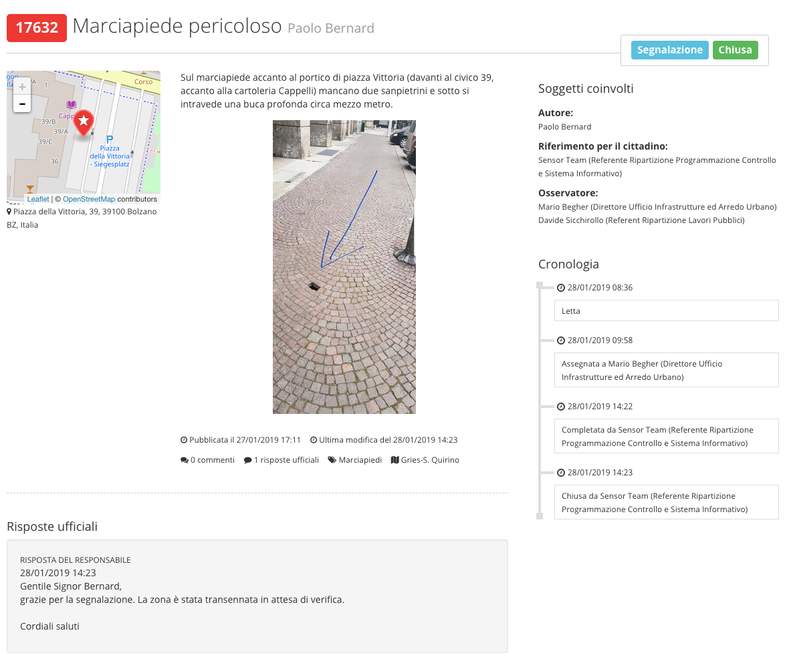

.. _h76543e41663e476b43502869623726e:

Come funziona OpenSegnalazioni?
*******************************

OpenSegnalazioni permette una \ |STYLE0|\  con i cittadini. 

Per esempio, se un cittadino si accorge di un malfunzionamento (es.: una buca su un marciapiede, un cestino dei rifiuti traboccante immondizia), può inserire una segnalazione,  dopo aver effettuato l’accesso alla piattaforma, geolocalizzando il problema segnalato.

L'amministrazione \ |STYLE1|\ , si occupa di \ |STYLE2|\  e provvede alla \ |STYLE3|\  (es.: riparare la buca, svuotare il cestino). 

Alla fine della procedura il cittadino riceve una notifica sull’esito della sua segnalazione.

Le segnalazioni sono visibili a chiunque visiti il sito, ma \ |STYLE4|\ . 

\ |IMG1|\ 

\ |STYLE5|\ 

.. bottom of content

.. |STYLE0| replace:: **collaborazione trasparente**

.. |STYLE1| replace:: **prende in carico la segnalazione**

.. |STYLE2| replace:: **informare l’ufficio competente**

.. |STYLE3| replace:: **risoluzione del problema**

.. |STYLE4| replace:: **per segnalare e operare è necessario accedere al sistema**

.. |STYLE5| replace:: *Una segnalazione conclusa. Sulla destra la cronologia descrive l’iter di gestione delle segnalazione. In basso la risposta ufficiale al cittadino.*

