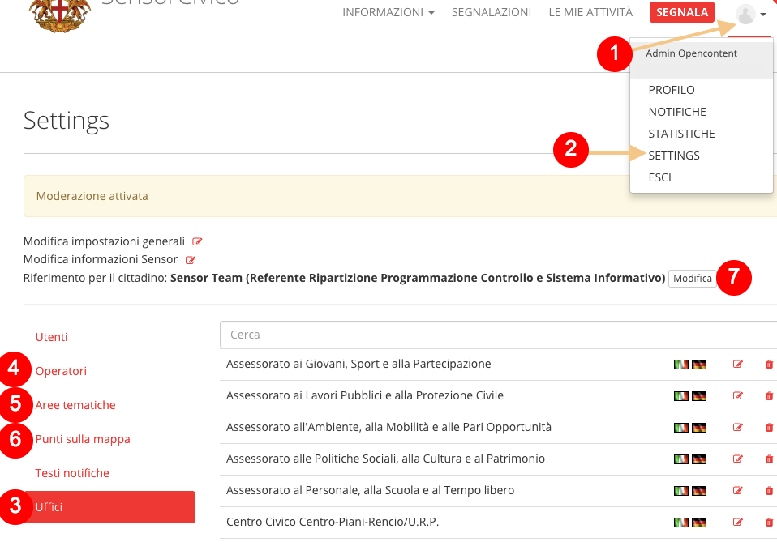
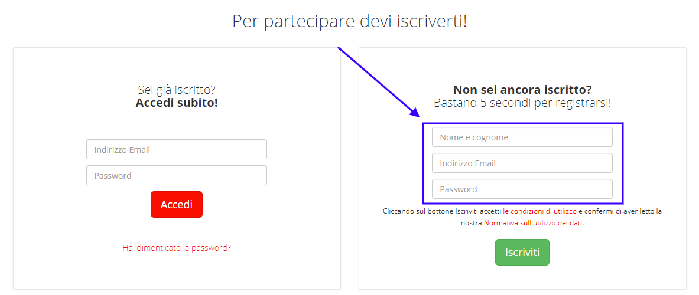
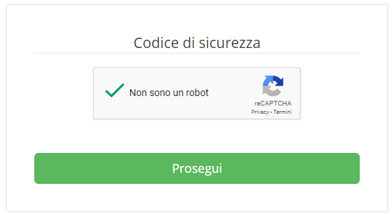
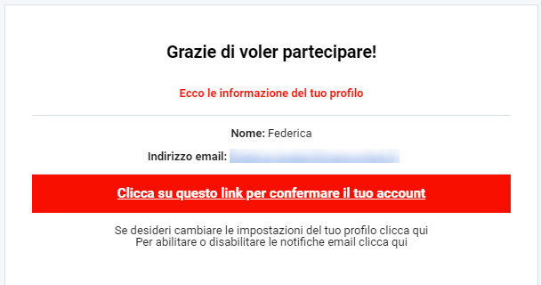
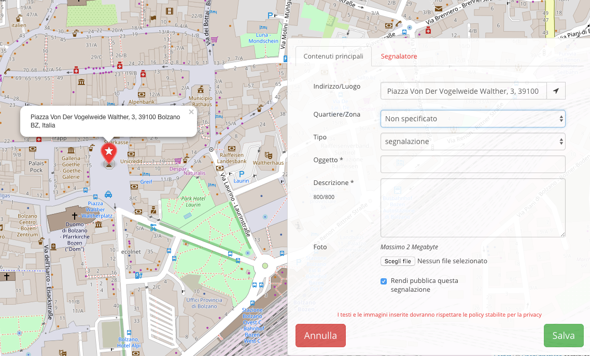

.. _h76543e41663e476b43502869623726e:

Come funziona OpenSegnalazioni?
*******************************

OpenSegnalazioni permette una \ |STYLE0|\  con i cittadini. 

Per esempio, se un cittadino si accorge di un malfunzionamento (es.: una buca su un marciapiede, un cestino dei rifiuti traboccante immondizia), può inserire una segnalazione,  dopo aver effettuato l’accesso alla piattaforma, geolocalizzando il problema segnalato.

L'amministrazione \ |STYLE1|\ , si occupa di \ |STYLE2|\  e provvede alla \ |STYLE3|\  (es.: riparare la buca, svuotare il cestino). 

Alla fine della procedura il cittadino riceve una notifica sull’esito della sua segnalazione.

Le segnalazioni sono visibili a chiunque visiti il sito, ma \ |STYLE4|\ . 

\ |IMG1|\ 

\ |STYLE5|\ 

.. _h2c1d74277104e41780968148427e:

.. _h2c1d74277104e41780968148427e:

.. _h483207ea7c2a7b1717417f627b5f57:

Manuale per l’amministratore
****************************

.. _h3d4fe431c28145ab79347f3f154058:

Configura il sistema
====================

In fase di configurazione del sistema, l’amministratore del sistema inserisce le informazioni necessarie al funzionamento dell’applicativo e crea le credenziali per gli operatori. 

Per un buon funzionamento, è consigliabile inserire le informazioni relative all’organigramma dell’ente, con la strutturazione in uffici legati alle persone che ci lavorano. 

Le persone inserite diventano gli \ |STYLE6|\  e i loro nomi, insieme al nome del loro ufficio di riferimento, vengono mostrati ogni qualvolta essi vengono chiamati in causa per la risoluzione di una segnalazione, in un’ottica di trasparenza.

Dopo aver effettuato l'accesso al sistema, dal menu apposito (1), l’amministratore sceglie la voce “Settings” (2). Da lì gestisce l’inserimento e la modifica di:

* Uffici (3);

* Operatori (4), ognuno dei quali legato a un ufficio;

* Aree tematiche (5);

* Punti sulla mappa (6).

Può anche impostare il “\ |STYLE7|\ ” (7).

\ |IMG2|\ 

.. _h234769304a74289656e465f58665b30:

Inserisci un riferimento per il cittadino (URP)
===============================================

Durante la configurazione, uno degli operatori viene impostato come “Riferimento per il cittadino”: si tratta dell’utente che si occupa di \ |STYLE8|\ .

In seguito allo svolgimento dell’iter della segnalazione, con risposte “interne” che arrivano dagli uffici di competenza, il Riferimento per il cittadino è l’operatore demandato a fornire al cittadino la risposta di chiusura di una segnalazione. Di fatto, è il \ |STYLE9|\ .

.. _h477812f57a6b654b3d34182f545d:

Crea i punti sulla mappa
========================

I punti sulla mappa possono essere \ |STYLE10|\  o \ |STYLE11|\  nelle quali è suddiviso il territorio. Compaiono nell’interfaccia di inserimento delle segnalazioni, dove viene chiesto al segnalatore di indicare l’area, oltre alla geolocalizzazione. 

Aiutano a delimitare le aree dove le segnalazioni sono state effettuate, risultando fondamentali per fini statistici.

Nella definizione dei punti sulla mappa, c’è un punto principale e dei sottopunti. Il punto principale è utilizzato dal sistema per centrare la mappa all’apertura di una nuova segnalazione. Solitamente indica il punto centrale del territorio di riferimento (ad esempio il municipio).

.. _h4362544b57354c4b3f43804e34532e:

Inserisci le Aree tematiche 
============================

Il sistema ha una lista di Aree tematiche (categorie) a cui è possibile legare le segnalazioni. L’amministratore può aggiungerne o modificarne. 

Le Aree, così come i Punti sul territorio, sono utili per la creazione dei grafici a fini statistici.

\ |IMG3|\ 

.. _h3846162056237f76803f10627221215f:

Manuale per gli operatori
*************************

.. _h68545712f3c317b13172146521b5729:

Gestisci le segnalazioni
========================

Le segnalazioni in ingresso vengono assegnate all’operatore “Referente per il cittadino”. Dal dettaglio di una segnalazione, attraverso una semplice interfaccia, egli si occupa di:

* dettagliare maggiormente la segnalazione, completando eventuali informazioni mancanti (ad esempio il “quartiere/zona”);

* assegnare la segnalazione agli operatori competenti nella materia oggetto della segnalazione;

* notificare altri operatori in copia (ad esempio responsabili di servizio);

* aggiungere un commento che sarà visibile ai cittadini;

* aggiungere un messaggio privato che solo gli altri operatori potranno leggere;

* rendere privata la segnalazione, in modo che non sia visibile solo all’amministrazione e al cittadino che l’ha aperta;

* chiudere la segnalazione, possibilmente dopo aver inserito un commento per il cittadino.

\ |IMG4|\ 

\ |STYLE12|\ 

Gli altri operatori ricevono una notifica quando gli viene assegnata una segnalazione. Aprono l’interfaccia di gestione della segnalazione e possono fare tutte le azioni descritte in precedenza, tranne chiudere la segnalazione. Infatti la chiusura spetta unicamente all’operatore Referente per il cittadino.

.. _h702c771340243556366a233cb3d737:

Manuale per gli utenti
**********************

.. _h112c6c6d73721023293351501d7c2c15:

Registrati alla piattaforma
===========================

Per poter inserire una segnalazione è necessario essere registrati sulla piattaforma.

Per registrarti alla piattaforma OpenSegnalazioni utilizza il box “\ |STYLE13|\ ” che trovi nella pagina principale.

Inserisci:

* Nome e cognome

* Un indirizzo email valido

* Una password di almeno 10 caratteri

\ |IMG5|\ 

\ |IMG6|\ 

Se la registrazione è andata a buon fine, comparirà questo messaggio.

\ |IMG7|\ 

Controlla la tua casella mail (il messaggio potrebbe essere stato categorizzato dal tuo gestore di posta come \ |STYLE14|\ ) e clicca sul link che trovi all’interno del messaggio, per confermare il tuo account.

\ |IMG8|\ 

Una volta attivato il tuo profilo, accedi al sistema e procedi con l’inserimento di una segnalazione all’interno della piattaforma.

.. _h2c1d74277104e41780968148427e:

.. _h4415848433f221aec1a14347f613e:

Accedi al sistema
=================

Dopo esserti registrato al sistema, puoi accedere alla piattaforma attraverso il pulsante “Accedi”, disponibile nel menu principale. 

\ |IMG9|\ 

Inserisci le credenziali (indirizzo mail e password)  impostate in fase di registrazione alla piattaforma (1).

\ |IMG10|\ 

Se hai dimenticato la password puoi richiedere la generazione di una nuova password cliccando sul link “Hai dimenticato la password?” (2).

\ |IMG11|\ 

Inserisci la tua mail (la stessa che hai utilizzato durante la fase di registrazione alla piattaforma), clicca sul pulsante “Genera una nuova password” e controlla la tua casella di posta elettronica. La tua nuova password ti è stata inviata via mail.

.. _h201e34111115357f5b8019465c5d5353:

Inserisci una segnalazione
==========================

Una volta effettuato l’accesso al sistema, un utente può inserire una nuova segnalazione. L’operazione è semplice anche da dispositivo mobile, dove il sistema funziona come un’app grazie alla sua interfaccia responsive.

Per inserire una segnalazione, premi la voce “Segnala” dal menu principale oppure il pulsante che compare nella pagina principale.

\ |IMG12|\ 

\ |IMG13|\ 

Si aprirà la schermata per l’inserimento di una segnalazione. 

\ |IMG14|\ 

\ |STYLE15|\ 

La mappa visualizzata è centrata sul punto centrale del territorio di riferimento (impostato dagli amministratori della piattaforma). 

Inserisci le seguenti informazioni:

* Indirizzo preciso della tua città in cui è localizzata la problematica che vuoi segnalare (il sistema può evincere la tua posizione attuale dai dati dello smartphone o del pc, se decidi di condividerli)

* Luogo in cui è localizzata la problematica che vuoi segnalare (quartiere, zona)

* Tipologia di segnalazione (segnalazione, reclamo, suggerimento)

* Oggetto della segnalazione (\*obbligatorio)

* Breve descrizione (\*obbligatorio)

* Fotografia (opzionale)

Puoi infine decidere se lasciare che la segnalazione sia pubblica (default) o che essa rimanga privata.

Una volta compilati i campi, premi sul pulsante \ |STYLE16|\  per inserire la segnalazione nel sistema oppure \ |STYLE17|\  se desidera annullare la segnalazione (i dati inseriti inseriti verranno eliminati). 

Se premi sul pulsante \ |STYLE18|\ , una notifica arriva all’operatore “Riferimento per il cittadino”, che dovrà accedere a sua volta al sistema per poter visionare la tua segnalazione: la segnalazione viene quindi presa in carico dall’amministrazione. Non ti resta altro che attendere e controllare l’iter di gestione e risoluzione.

.. _h34571412716383f75482b307375876:

Controlla lo stato della tua segnalazione
=========================================

Una volta inserita, è sempre possibile visualizzazione lo stato di avanzamento della segnalazione (fino al momento della risoluzione e della chiusura).

Per controllare lo stato della tua segnalazione basta accedere al tuo profilo, cliccare su \ |STYLE19|\  e selezionare la segnalazione che vuoi monitorare.

Sulla destra, controlla il box \ |STYLE20|\ .

\ |IMG15|\ 

.. bottom of content

.. |STYLE0| replace:: **collaborazione trasparente**

.. |STYLE1| replace:: **prende in carico la segnalazione**

.. |STYLE2| replace:: **informare l’ufficio competente**

.. |STYLE3| replace:: **risoluzione del problema**

.. |STYLE4| replace:: **per segnalare e operare è necessario accedere al sistema**

.. |STYLE5| replace:: *Una segnalazione conclusa. Sulla destra la cronologia descrive l’iter di gestione delle segnalazione. In basso la risposta ufficiale al cittadino.*

.. |STYLE6| replace:: **operatori di OpenSegnalazioni**

.. |STYLE7| replace:: **Riferimento per il cittadino**

.. |STYLE8| replace:: **smistare le segnalazioni verso gli uffici competenti e gli operatori ad essi legati**

.. |STYLE9| replace:: **punto di contatto dell’ente nei confronti di un cittadino**

.. |STYLE10| replace:: **quartieri**

.. |STYLE11| replace:: **zone**

.. |STYLE12| replace:: *L’interfaccia di gestione di una segnalazione*

.. |STYLE13| replace:: **Non sei ancora iscritto?**

.. |STYLE14| replace:: **spam**

.. |STYLE15| replace:: *L’interfaccia per l’inserimento di una segnalazione*

.. |STYLE16| replace:: **Salva**

.. |STYLE17| replace:: **Annulla**

.. |STYLE18| replace:: **Salva**

.. |STYLE19| replace:: **Segnalazioni**

.. |STYLE20| replace:: **Cronologia**

.. |IMG1| image:: static/Manuale_OpenSegnalazioni_1.png
   :height: 526 px
   :width: 624 px

.. |IMG3| image:: static/Manuale_OpenSegnalazioni_3.png
   :height: 384 px
   :width: 489 px

.. |IMG4| image:: static/Manuale_OpenSegnalazioni_4.png
   :height: 318 px
   :width: 624 px

.. |IMG9| image:: static/Manuale_OpenSegnalazioni_9.png
   :height: 364 px
   :width: 624 px

.. |IMG10| image:: static/Manuale_OpenSegnalazioni_10.png
   :height: 262 px
   :width: 624 px

.. |IMG11| image:: static/Manuale_OpenSegnalazioni_11.png
   :height: 172 px
   :width: 624 px

.. |IMG12| image:: static/Manuale_OpenSegnalazioni_12.png
   :height: 44 px
   :width: 560 px

.. |IMG15| image:: static/Manuale_OpenSegnalazioni_15.png
   :height: 378 px
   :width: 400 px
