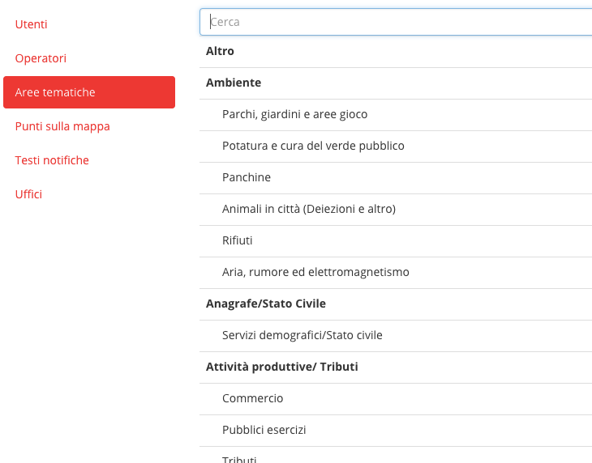
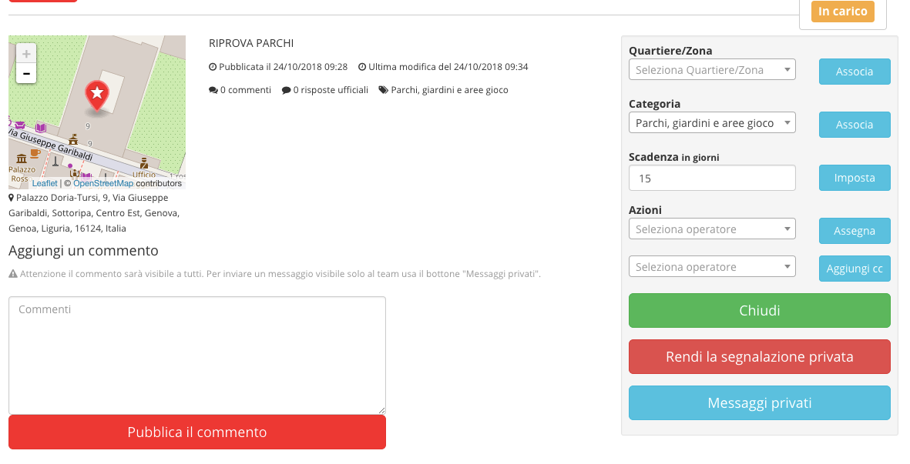

.. _h2f2a293a29599593878231a242075:

Manuale OpenSegnalazioni
************************

OpenSegnalazioni è uno strumento web che consente alla Pubblica Amministrazione  di mettersi in ascolto dei cittadini. I cittadini possono inserire nel sistema le lore segnalazioni, che vengono prese in carico dal personale dell’ente in base alle competenze. La gestione della segnalazione è trasparente al cittadino, che in ogni momento può verificarne lo stato.

L’applicazione può generare report grafici per misurare le performance relative alla gestione delle segnalazioni dei cittadini.

.. _h63227f65484e5af3bb80471587d6f:

Funzionamento tipico
====================

Un cittadino si accorge di un malfunzionamento (ad esempio una buca su un marciapiede, un cestino dei rifiuti traboccante immondizia), effettua l’accesso alla piattaforma e inserisce una segnalazione, geolocalizzando il problema segnalato.

L'amministrazione prende in carico la segnalazione, provvede ad informare l’ufficio competente e provvede alla risoluzione del problema (riparare la buca, svuotare il cestino). 

Alla fine della procedura  il cittadino riceve una notifica sull’esito della sua segnalazione.

\ |IMG1|\ 

\ |STYLE0|\ 

.. _h6e4d39105a64461f4f3377d353919:

Accesso al sistema
==================

Le segnalazioni sono visibili a chiunque visiti il sito, ma per segnalare e operare è necessario accedere al sistema. In fase di configurazione vengono create le credenziali per gli operatori, mentre i cittadini possono registrarsi attraverso l’apposito form di registrazione.

L’accesso al sistema avviene cliccando sul pulsante “accedi”, dal menu principale. 

\ |IMG2|\ 

Si viene direzionati al form di accesso dove inserire le proprie credenziali.

.. _h2c1247665f36697b2b2b1b392c7a605b:

Manuale per l’amministratore (configurazione del sistema)
=========================================================

In fase di configurazione del sistema, l’amministratore inserisce le informazioni necessarie al sistema, e create le credenziali per gli operatori. 

Per un buon funzionamento, è consigliabile inserire le informazioni relative all’organigramma dell’ente, con la strutturazione in uffici legate alle persone che ci lavorano. Le persone inserite diventano gli operatori di OpenSegnalazioni, e i loro nomi, insieme al nome del loro ufficio di riferimento, vengono mostrati ogni qualvolta essi vengono chiamati in causa per la risoluzione di una segnalazione, in un’ottica di trasparenza.

Dopo aver acceduto il sistema, l’amministratore accede al sistema e, dal menu apposito (1) sceglie la voce “settings” (2). Da lì gestisce l’inserimento e modifica di:

* Uffici (3);

* Operatori (4), ognuno dei quali legato a un ufficio;

* Aree tematiche (5);

* Punti sulla mappa (6).

Può anche impostare il “Riferimento per il cittadino” (7).

\ |IMG3|\ 

.. _h7c1320f2b4b6e2e39437c7f7b1f2013:

Riferimento per il cittadino
----------------------------

Durante la configurazione, uno degli operatori viene impostato come “riferimento per il cittadino”: si tratta dell’utente che si occupa di smistare le segnalazioni verso gli uffici competenti e gli operatori ad esso legati.

In seguito allo svolgimento dell’iter della segnalazione, con risposte “interne” che arrivano dagli uffici di competenza, il Riferimento per il cittadino è l’operatore demandato a fornire al cittadino la risposta di chiusura di una segnalazione. Di fatto, è il punto di contatto dell’ente nei confronti di un cittadino.

.. _h7f5e71451e79807a7c4583912171a3b:

Creazione dei punti sulla mappa
-------------------------------

I punti sulla mappa possono essere quartieri o zone nelle quali è suddiviso il territorio. Compaiono nell’interfaccia di inserimento delle segnalazioni, dove viene chiesto al segnalatore di indicare l’area, oltre alla geolocalizzazione. 

Aiutano a delimitare le aree  dove le segnalazioni sono state effettuale, risultando fondamentali per fini statistici.

Nella definizione dei punti sulla mappa, c’è un punto principale e dei sottopunti. Il punto principale è utilizzato dal sistema per centrare la mappa all’apertura di una nuova segnalazione. Solitamente indica il punto centrale del territorio di riferimento (ad esempio il municipio).

.. _h3b7c1437482f57c774c234244333a7d:

Aree tematiche (categorie)
--------------------------

Il sistema ha una lista di Aree tematiche (categorie) a cui è possibile legare le segnalazioni. L’amministratore può aggiungerne o modificarne. 

Le Aree, così come i Punti sul territorio, sono utili per la creazione dei grafici a fini statistici.

\ |IMG4|\ 

.. _h3846162056237f76803f10627221215f:

Manuale per gli operatori
=========================

.. _h56234a77427f791e445640203170112:

Gestione delle segnalazioni
---------------------------

Le segnalazioni in ingresso vengono assegnate all’operatore “Referente per il cittadino”. Dal dettaglio di una segnalazione, attraverso una semplice interfaccia, egli si occupa di:

* dettagliare maggiormente completando eventuali informazioni mancanti (ad esempio il “quartiere/zona”);

* Assegnare la segnalazione agli operatori competenti nella materia oggetto della segnalazione;

* Notificare altri operatori in copia (ad esempio responsabili di servizio);

* Aggiungere un commento che sarà visibile ai cittadini;

* Aggiungere un messaggio privato che solo gli altri operatori potranno leggere;

* Rendere privata la segnalazione, in modo che non sia visibile solo all’amministrazione e al cittadino che l’ha aperta;

* Chiudere la segnalazione, possibilmente dopo aver inserito un commento per il cittadino.

\ |IMG5|\ 

\ |STYLE1|\ 

Gli altri operatori ricevono una notifica quando gli viene assegnata una segnalazione. Aprono l’interfaccia di gestione della segnalazione e possono fare tutte le azioni descritte in precedenza, tranne chiudere la segnalazione. Infatti la chiusura spetta unicamente all’operatore Referente per il cittadino.

.. _h702c771340243556366a233cb3d737:

Manuale per gli utenti
======================

Una volta effettuato l’accesso al sistema, un utente può inserire una nuova segnalazione. L’operazione è semplice anche da dispositivo mobile, dove il sistema funziona come un’app grazie alla sua interfaccia responsive.

.. _h334361375e71544c25235dd3b385320:

Inserimento di una segnalazione
-------------------------------

Per inserire una segnalazione, è necessario premere la voce “Segnala” dal menu principale:

\ |IMG6|\ 

Si apre la schermata per l’inserimento di una segnalazione. E’ visualizzata una mappa centrata sul punto centrale del territorio di riferimento (impostato dall’amministratore in fase di configurazione). 

Il cittadino deve inserire una geolocalizzazione (il sistema la può evincere dai dati dello smartphone), può scegliere uno dei luoghi (quartieri, zone), il tipo di segnalazione (dalla lista delle Aree tematiche). Poi deve inserire l’oggetto e una breve descrizione. Può corredare il tutto con una fotografia, e decidere se lasciare che la segnalazione sia pubblica (default) o che essa diventi privata.

\ |IMG7|\ 

\ |STYLE2|\ 

Una volta compilati i campi, il cittadino preme sul pulsante salva per inserire la segnalazione nel sistema. Una notifica arriva all’operatore “Riferimento per il cittadino”, che accede a sua volta al sistema. La segnalazione è presa in carico dall’amministrazione, e al cittadino non resta altro che attendere e controllare l’iter di gestione e risoluzione.

.. bottom of content

.. |STYLE0| replace:: *Una segnalazione conclusa. Sulla destra la cronologia descrive l’iter di gestione delle segnalazione. In basso la risposta ufficiale al cittadino.*

.. |STYLE1| replace:: *L’interfaccia di gestione di una segnalazione*

.. |STYLE2| replace:: *L’interfaccia per l’inserimento di una segnalazione*

.. |IMG1| image:: static/Manuale_OpenSegnalazioni_1.png
   :height: 526 px
   :width: 624 px

.. |IMG2| image:: static/Manuale_OpenSegnalazioni_2.png
   :height: 70 px
   :width: 420 px

.. |IMG5| image:: static/Manuale_OpenSegnalazioni_5.png
   :height: 318 px
   :width: 624 px

.. |IMG6| image:: static/Manuale_OpenSegnalazioni_6.png
   :height: 44 px
   :width: 560 px

.. |IMG7| image:: static/Manuale_OpenSegnalazioni_7.png
   :height: 377 px
   :width: 624 px
