.. _h483207ea7c2a7b1717417f627b5f57:

Manuale per l’amministratore
****************************

.. _h4415848433f221aec1a14347f613e:

Accedi al sistema
=================

Dopo aver ricevuto le credenziali di accesso al sistema come \ |STYLE0|\ , puoi accedere alla piattaforma attraverso il pulsante “Accedi”, disponibile nel menu principale. 

\ |IMG1|\ 

Inserisci le credenziali (indirizzo mail e password) da te impostate in fase di primo accesso alla piattaforma (1).

\ |IMG2|\ 

Se hai dimenticato la password puoi richiedere la generazione di una nuova password cliccando sul link “Hai dimenticato la password?” (2).

\ |IMG3|\ 

Inserisci la tua mail (la stessa utilizzata durante la fase di registrazione alla piattaforma), clicca sul pulsante “Genera una nuova password” e controlla la tua casella di posta elettronica. La tua nuova password ti è stata inviata via mail.

.. _h2c1d74277104e41780968148427e:

.. _h3d4fe431c28145ab79347f3f154058:

Configura il sistema
====================

In fase di configurazione del sistema, l’amministratore del sistema inserisce le informazioni necessarie al funzionamento dell’applicativo e crea le credenziali per gli operatori. 

Per un buon funzionamento, è consigliabile inserire le informazioni relative all’organigramma dell’ente, con la strutturazione in uffici legati alle persone che ci lavorano. 

Le persone inserite diventano gli \ |STYLE1|\  e i loro nomi, insieme al nome del loro ufficio di riferimento, vengono mostrati ogni qualvolta essi vengono chiamati in causa per la risoluzione di una segnalazione, in un’ottica di trasparenza.

Dopo aver effettuato l'accesso al sistema, dal menu apposito (1), l’amministratore sceglie la voce “Settings” (2). Da lì gestisce l’inserimento e la modifica di:

* Uffici (3);

* Operatori (4), ognuno dei quali legato a un ufficio;

* Aree tematiche (5);

* Punti sulla mappa (6).

Può anche impostare il “\ |STYLE2|\ ” (7).

\ |IMG4|\ 

.. _h2c1d74277104e41780968148427e:

.. _h441c4f18433334404332f34472d1b59:

Inserisci gli operatori
=======================

Per inserire gli operatori che prenderanno in carico le segnalazioni, effettua l'accesso al sistema e seleziona, dal menu in alto a destra la voce \ |STYLE3|\ . All’interno del menù sulla sinistra seleziona la voce \ |STYLE4|\ .

Clicca poi sul pulsante \ |STYLE5|\  (1) che trovi accanto al punto principale. Si aprirà l’interfaccia per l’inserimento e la creazione di un nuovo \ |STYLE6|\ .

.. _h10357727f5f612f3d2d3f7a344e3c26:

\ |IMG5|\ ==========

\ |IMG6|\ 

\ |STYLE7|\ 

Inserisci i dati richiesti e clicca su \ |STYLE8|\  per pubblicare l’operatore.

Se gli utenti sono già stati caricati nel sistema, seleziona invece \ |STYLE9|\  (2).

.. _h756a352c74f366066557d5675585624:

\ |IMG7|\ ==========

.. _h2c1d74277104e41780968148427e:

.. _h234769304a74289656e465f58665b30:

Inserisci un riferimento per il cittadino (URP)
===============================================

Durante la configurazione, uno degli operatori viene impostato come “Riferimento per il cittadino”: si tratta dell’utente che si occupa di \ |STYLE10|\ .

In seguito allo svolgimento dell’iter della segnalazione, con risposte “interne” che arrivano dagli uffici di competenza, il Riferimento per il cittadino è l’operatore demandato a fornire al cittadino la risposta di chiusura di una segnalazione. Di fatto, è il \ |STYLE11|\ .

\ |IMG8|\ 

Per configurare o modificare il Riferimento per il cittadino, nel menù in alto a destra, clicca sulla voce Setting e poi su \ |STYLE12|\  situato a lato della voce “Riferimento per il cittadino”.

Selezioni uno degli Operatori inseriti precedentemente e clicca su Seleziona.

.. _h217f7b79551f5a5113215e625811793:

Imposta le aree geografiche di riferimento attraverso i “punti sulla mappa”
===========================================================================

I punti sulla mappa possono essere \ |STYLE13|\  o \ |STYLE14|\  nelle quali è suddiviso il territorio. Compaiono nell’interfaccia di inserimento delle segnalazioni, dove viene chiesto al segnalatore di indicare l’area, oltre alla geolocalizzazione. 

\ |IMG9|\ 

\ |STYLE15|\ 

Aiutano a delimitare le aree dove le segnalazioni sono state effettuate, risultando fondamentali per fini statistici.

\ |IMG10|\ 

Nella definizione dei punti sulla mappa, c’è un punto principale e dei sottopunti. Il punto principale è utilizzato dal sistema per centrare la mappa all’apertura di una nuova segnalazione. Solitamente indica il punto centrale del territorio di riferimento (ad esempio il municipio).

Per inserire un nuovo quartiere o zona, effettua l'accesso al sistema e seleziona, dal menu in alto a destra la voce \ |STYLE16|\ . All’interno del menù sulla sinistra seleziona la voce \ |STYLE17|\ .

\ |IMG11|\ 

Clicca poi sul pulsante  “\ |STYLE18|\ ” che trovi accanto al punto principale.

Si aprirà l’interfaccia per l’inserimento e la creazione di un nuovo \ |STYLE19|\ .

\ |IMG12|\ 

\ |STYLE20|\ 

Inserisci il nome della zona/quartiere che vuoi inserire, il punto di localizzazione principale e un eventuale Responsabile di area (scegliendo tra quelli già inseriti).

Clicca poi su \ |STYLE21|\  per pubblicare il contenuto.

.. _h62465646545b677b44317a4f774a185:

Inserisci le aree tematiche 
============================

Il sistema ha una lista di Aree tematiche (categorie) a cui è possibile legare le segnalazioni. L’amministratore può aggiungerne o modificarne. 

Le Aree, così come i Punti sul territorio, sono utili per la creazione dei grafici a fini statistici.

Per aggiungere le Aree tematiche, effettua l'accesso al sistema e seleziona, dal menu in alto a destra la voce \ |STYLE22|\ . All’interno del menù sulla sinistra seleziona la voce \ |STYLE23|\ .

\ |IMG13|\ 

Puoi decidere di inserire un’Area tematica con il pulsante \ |STYLE24|\  (2), mentre per inserire una voce secondaria clicca sul pulsante “\ |STYLE25|\ ” (1) a lato dell’Area tematica di riferimento principale.

\ |IMG14|\ 

.. _h810281b6db4a761b326659783c771d:

Personalizza la piattaforma
===========================

Per modificare le impostazioni generali, effettua l'accesso al sistema e seleziona, dal menu in alto a destra la voce \ |STYLE26|\  e poi la voce “Modifica impostazioni generali”.\ |IMG15|\ 

Attraverso questa schermata è possibile modificare:

* il logo (1)

* il titolo (2)

* il sottotitolo (3)

* il Banner (4)

* il titolo del banner (5)

* il sottotitolo del banner (6)

* le informazioni relative alle voci: FAQ, Privacy, Termini di utilizzo (7)

* il testo per il footer

* i contatti

\ |IMG16|\ 

\ |IMG17|\ 

.. bottom of content

.. |STYLE0| replace:: **amministratore**

.. |STYLE1| replace:: **operatori di OpenSegnalazioni**

.. |STYLE2| replace:: **Riferimento per il cittadino**

.. |STYLE3| replace:: **Settings**

.. |STYLE4| replace:: **Operatori**

.. |STYLE5| replace:: **Aggiungi Sensor Operatore**

.. |STYLE6| replace:: **Operatore**

.. |STYLE7| replace:: *Interfaccia di inserimento di un operatore*

.. |STYLE8| replace:: **Salva**

.. |STYLE9| replace:: **Aggiungi utente esistente**

.. |STYLE10| replace:: **smistare le segnalazioni verso gli uffici competenti e gli operatori ad essi legati**

.. |STYLE11| replace:: **punto di contatto dell’ente nei confronti di un cittadino**

.. |STYLE12| replace:: **Modifica**

.. |STYLE13| replace:: **quartieri**

.. |STYLE14| replace:: **zone**

.. |STYLE15| replace:: *Interfaccia di inserimento di una segnalazione*

.. |STYLE16| replace:: **Settings**

.. |STYLE17| replace:: **Punti sulla mappa**

.. |STYLE18| replace:: **+**

.. |STYLE19| replace:: **Sensor Punto sulla mappa**

.. |STYLE20| replace:: *Interfaccia di inserimento di un Punto sulla mappa*

.. |STYLE21| replace:: **Salva**

.. |STYLE22| replace:: **Settings**

.. |STYLE23| replace:: **Aree tematiche**

.. |STYLE24| replace:: **Aggiungi Sensor Area tematica**

.. |STYLE25| replace:: **+**

.. |STYLE26| replace:: **Settings**

.. |IMG1| image:: static/Manuale_per_l’amministratore_1.png
   :height: 364 px
   :width: 624 px

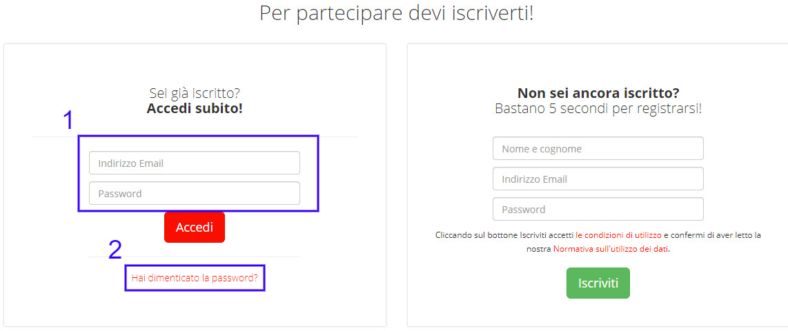

.. |IMG3| image:: static/Manuale_per_l’amministratore_3.png
   :height: 172 px
   :width: 624 px

.. |IMG4| image:: static/Manuale_per_l’amministratore_4.png
   :height: 438 px
   :width: 624 px

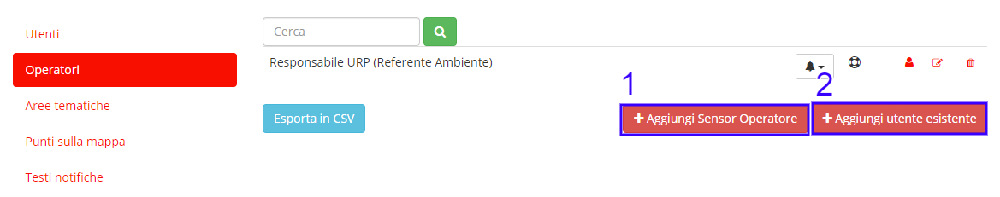

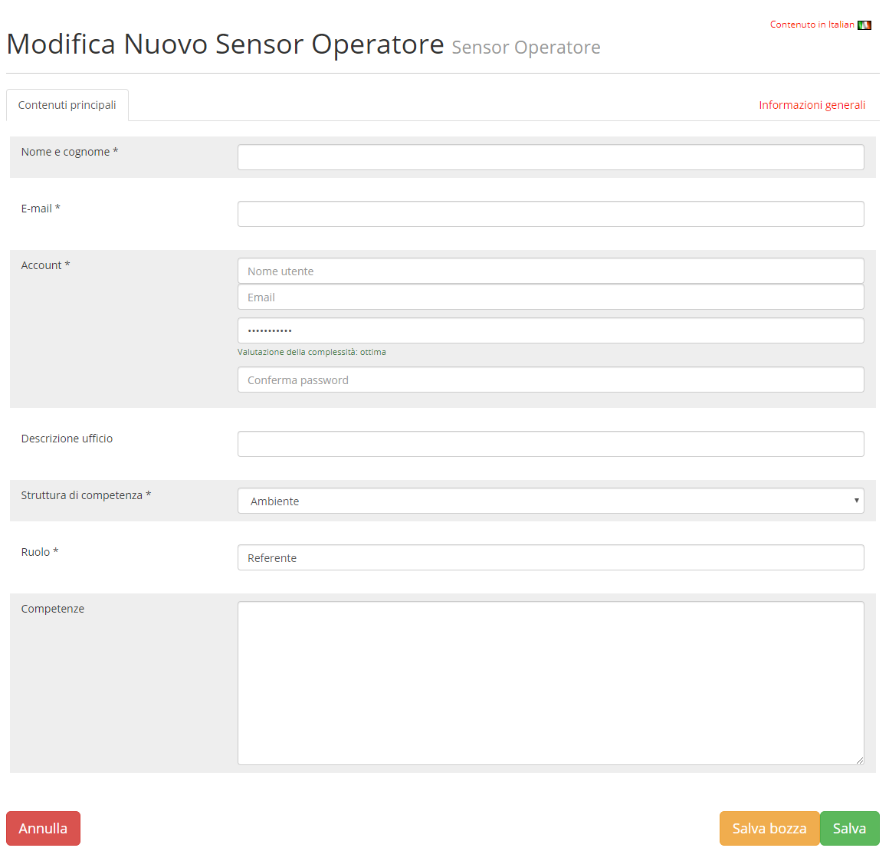

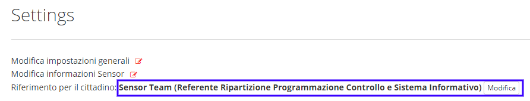

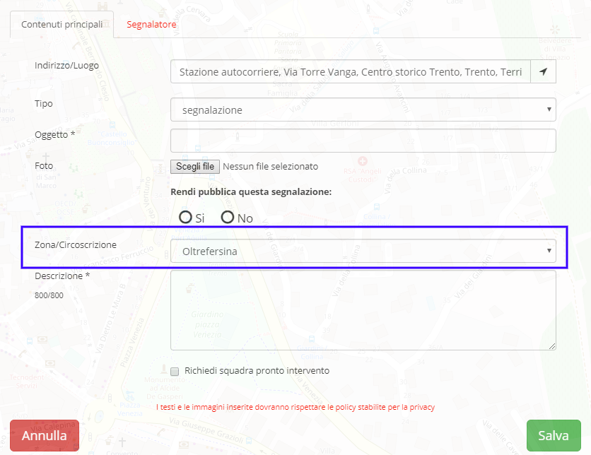

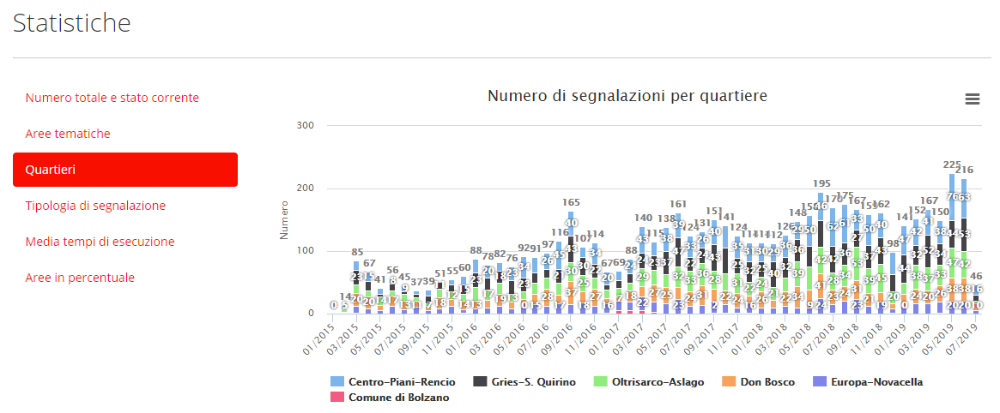

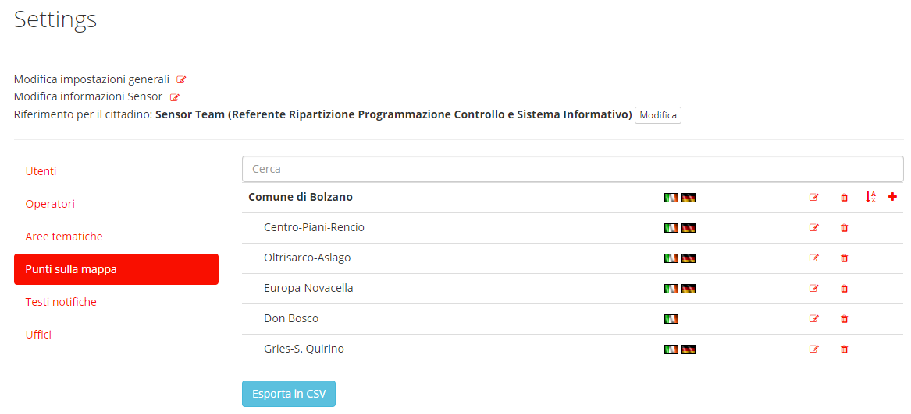

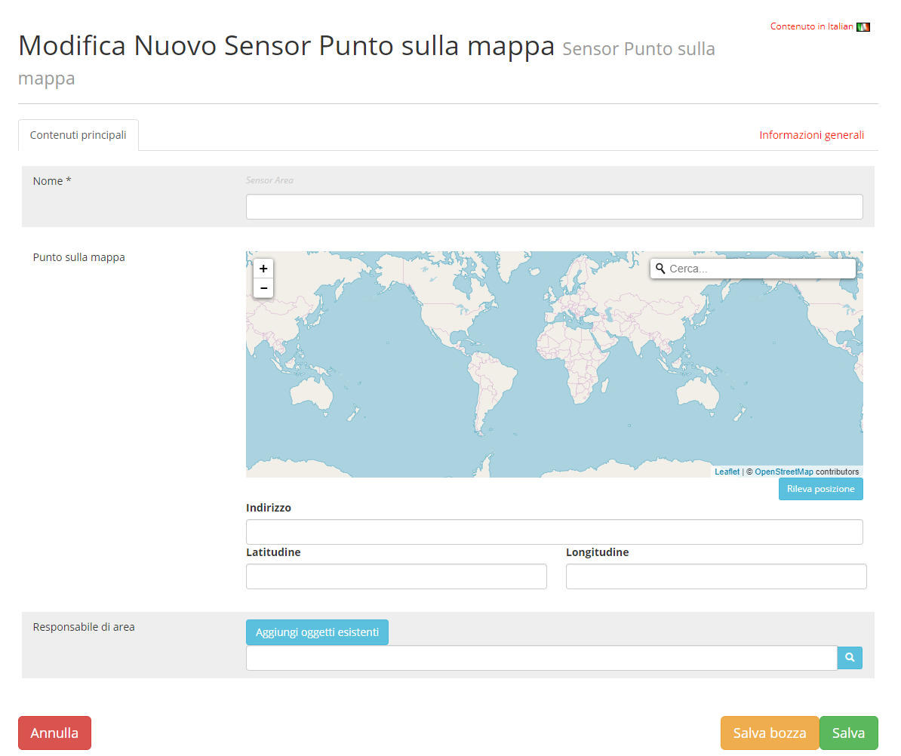

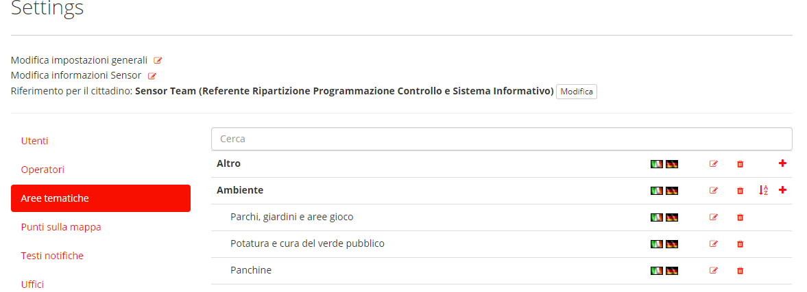

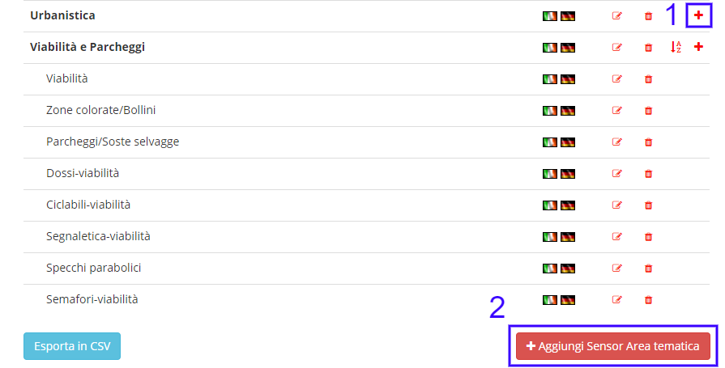

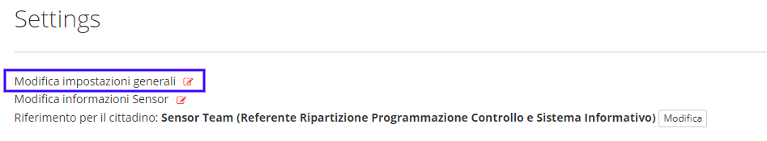

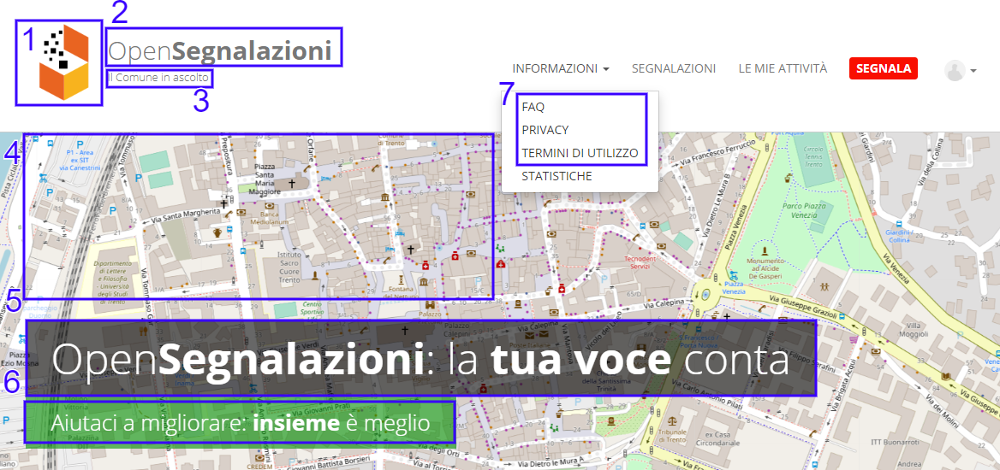

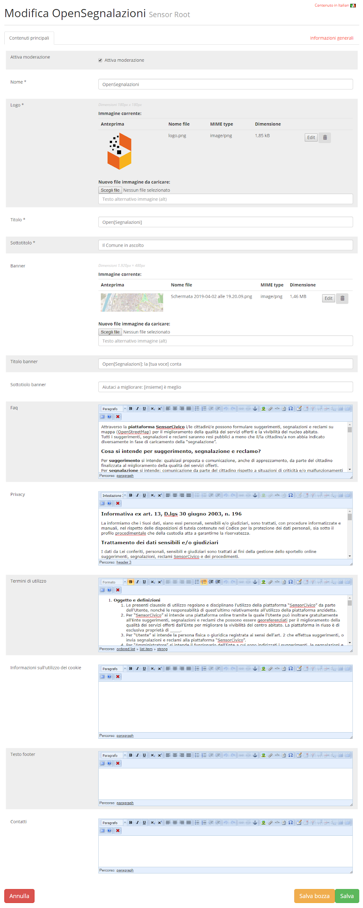
