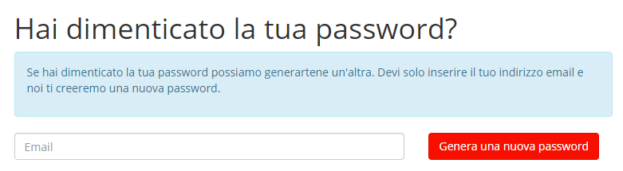

.. _h753a131d4a6c392a61f3f402f624f71:

Manuale per i cittadini
***********************

.. _h112c6c6d73721023293351501d7c2c15:

Registrati alla piattaforma
===========================

Per poter inserire una segnalazione è necessario essere registrati sulla piattaforma.

Per registrarti alla piattaforma OpenSegnalazioni utilizza il box “\ |STYLE0|\ ” che trovi nella pagina principale.

Inserisci:

* Nome e cognome

* Un indirizzo email valido

* Una password di almeno 10 caratteri

\ |IMG1|\ 

\ |IMG2|\ 

Se la registrazione è andata a buon fine, comparirà questo messaggio.

\ |IMG3|\ 

Controlla la tua casella mail (il messaggio potrebbe essere stato categorizzato dal tuo gestore di posta come \ |STYLE1|\ ) e clicca sul link che trovi all’interno del messaggio, per confermare il tuo account.

\ |IMG4|\ 

Una volta attivato il tuo profilo, accedi al sistema e procedi con l’inserimento di una segnalazione all’interno della piattaforma.

.. _h2c1d74277104e41780968148427e:

.. _h4415848433f221aec1a14347f613e:

Accedi al sistema
=================

Dopo esserti registrato al sistema, puoi accedere alla piattaforma attraverso il pulsante “Accedi”, disponibile nel menu principale. 

\ |IMG5|\ 

Inserisci le credenziali (indirizzo mail e password)  impostate in fase di registrazione alla piattaforma (1).

\ |IMG6|\ 

Se hai dimenticato la password puoi richiedere la generazione di una nuova password cliccando sul link “Hai dimenticato la password?” (2).

\ |IMG7|\ 

Inserisci la tua mail (la stessa che hai utilizzato durante la fase di registrazione alla piattaforma), clicca sul pulsante “Genera una nuova password” e controlla la tua casella di posta elettronica. La tua nuova password ti è stata inviata via mail.

.. _h201e34111115357f5b8019465c5d5353:

Inserisci una segnalazione
==========================

Una volta effettuato l’accesso al sistema, un utente può inserire una nuova segnalazione. L’operazione è semplice anche da dispositivo mobile, dove il sistema funziona come un’app grazie alla sua interfaccia responsive.

Per inserire una segnalazione, premi la voce “Segnala” dal menu principale oppure il pulsante che compare nella pagina principale.

\ |IMG8|\ 

\ |IMG9|\ 

Si aprirà la schermata per l’inserimento di una segnalazione. 

\ |IMG10|\ 

\ |STYLE2|\ 

La mappa visualizzata è centrata sul punto centrale del territorio di riferimento (impostato dagli amministratori della piattaforma). 

Inserisci le seguenti informazioni:

* Indirizzo preciso della tua città in cui è localizzata la problematica che vuoi segnalare (il sistema può evincere la tua posizione attuale dai dati dello smartphone o del pc, se decidi di condividerli)

* Luogo in cui è localizzata la problematica che vuoi segnalare (quartiere, zona)

* Tipologia di segnalazione (segnalazione, reclamo, suggerimento)

* Oggetto della segnalazione (\*obbligatorio)

* Breve descrizione (\*obbligatorio)

* Fotografia (opzionale)

Puoi infine decidere se lasciare che la segnalazione sia pubblica (default) o che essa rimanga privata.

Una volta compilati i campi, premi sul pulsante \ |STYLE3|\  per inserire la segnalazione nel sistema oppure \ |STYLE4|\  se desidera annullare la segnalazione (i dati inseriti inseriti verranno eliminati). 

Se premi sul pulsante \ |STYLE5|\ , una notifica arriva all’operatore “Riferimento per il cittadino”, che dovrà accedere a sua volta al sistema per poter visionare la tua segnalazione: la segnalazione viene quindi presa in carico dall’amministrazione. Non ti resta altro che attendere e controllare l’iter di gestione e risoluzione.

.. _h34571412716383f75482b307375876:

Controlla lo stato della tua segnalazione
=========================================

Una volta inserita, è sempre possibile visualizzazione lo stato di avanzamento della segnalazione (fino al momento della risoluzione e della chiusura).

Per controllare lo stato della tua segnalazione basta accedere al tuo profilo, cliccare su \ |STYLE6|\  e selezionare la segnalazione che vuoi monitorare.

Sulla destra, controlla il box \ |STYLE7|\ .

\ |IMG11|\ 

.. bottom of content

.. |STYLE0| replace:: **Non sei ancora iscritto?**

.. |STYLE1| replace:: **spam**

.. |STYLE2| replace:: *L’interfaccia per l’inserimento di una segnalazione*

.. |STYLE3| replace:: **Salva**

.. |STYLE4| replace:: **Annulla**

.. |STYLE5| replace:: **Salva**

.. |STYLE6| replace:: **Segnalazioni**

.. |STYLE7| replace:: **Cronologia**

.. |IMG1| image:: static/Manuale_per_i_cittadini_1.png
   :height: 264 px
   :width: 624 px

.. |IMG2| image:: static/Manuale_per_i_cittadini_2.png
   :height: 272 px
   :width: 497 px

.. |IMG3| image:: static/Manuale_per_i_cittadini_3.png
   :height: 377 px
   :width: 504 px

.. |IMG4| image:: static/Manuale_per_i_cittadini_4.png
   :height: 320 px
   :width: 608 px

.. |IMG5| image:: static/Manuale_per_i_cittadini_5.png
   :height: 364 px
   :width: 624 px

.. |IMG6| image:: static/Manuale_per_i_cittadini_6.png
   :height: 262 px
   :width: 624 px

.. |IMG9| image:: static/Manuale_per_i_cittadini_9.png
   :height: 245 px
   :width: 624 px

.. |IMG10| image:: static/Manuale_per_i_cittadini_10.png
   :height: 377 px
   :width: 624 px

