.. _h3846162056237f76803f10627221215f:

Manuale per gli operatori
*************************

Le segnalazioni in ingresso vengono assegnate, dal sistema, all’operatore \ |STYLE0|\ , il quale si occupa di smistare le segnalazioni in entrata e di assegnarle all’\ |STYLE1|\  che fa parte dell’Ufficio competente.

Dal dettaglio di una segnalazione, come Operatore o Referente per il cittadino puoi, attraverso una semplice interfaccia, eseguire tutte le operazioni sotto-elencate (solo la chiusura della segnalazione è prerogativa del Referente del cittadino) .

.. _h4415848433f221aec1a14347f613e:

Accedi al sistema
=================

Dopo aver ricevuto le credenziali di accesso al sistema come \ |STYLE2|\ , puoi accedere alla piattaforma attraverso il pulsante “Accedi”, disponibile nel menu principale. 

\ |IMG1|\ 

Al primo accesso ti verrà chiesto di creare una nuova password.

Durante i successivi accessi, inserisci le credenziali (indirizzo mail e password) da te impostate in fase di primo accesso alla piattaforma (1).

\ |IMG2|\ 

Se hai dimenticato la password puoi richiedere la generazione di una nuova password cliccando sul link “Hai dimenticato la password?” (2).

\ |IMG3|\ 

Inserisci la tua mail (la stessa utilizzata durante la fase di registrazione alla piattaforma), clicca sul pulsante “Genera una nuova password” e controlla la tua casella di posta elettronica. La tua nuova password ti è stata inviata via mail.

.. _h7a792e6980112330164c2b583f7c2c77:

Visualizza le tue segnalazioni
==============================

Ogni volta che un utente inserisce una segnalazione all’interno del sistema, il \ |STYLE3|\  riceverà una notifica via mail.

Per visualizzare il contenuto della segnalazione e assegnare la segnalazione all’operatore competente, clicca sul link che trovi all’interno della e-mail.

Una volta assegnata la segnalazione ad un \ |STYLE4|\  competente, anche l’Operatore incaricato riceverà a sua volta una notifica via mail. Per visualizzare il contenuto della segnalazione, clicca sul link che trovi all’interno della e-mail.

Puoi sempre accedere a tutte le segnalazioni a te assegnate, effettuando l’accesso al sistema e cliccando sulla voce di menù \ |STYLE5|\ .

\ |IMG4|\ 

Seleziona poi la segnalazione che desideri gestire cliccando sul titolo della segnalazione, sul  numero identificativo oppure sul pulsante \ |STYLE6|\ .

\ |IMG5|\ 

.. _h52622f425075215b32141c51574b3f1e:

Aggiungi informazioni alla segnalazione
=======================================

Come \ |STYLE7|\  o \ |STYLE8|\ , puoi dettagliare maggiormente una segnalazione inserita nel sistema, completandola con eventuali informazioni mancanti, come ad esempio il “quartiere/zona” (1) oppure la categoria/area tematica (2). Dopo aver inserito una \ |STYLE9|\  e/o una \ |STYLE10|\  clicca sul pulsante \ |STYLE11|\ .

\ |IMG6|\ 

.. _h614395d7b1f4f6d35357e7274342526:

Imposta una scadenza
====================

Come \ |STYLE12|\  o \ |STYLE13|\ , puoi inserire una scadenza per la risoluzione della problematica segnalata. Per farlo inserisci un numero corrispondente ai giorni entro cui l’amministrazione si impegna a risolvere la problematica segnalata e clicca sul pulsante \ |STYLE14|\ .

\ |IMG7|\ 

 

.. _hf50667364342a423546153f476b2:

Rendi la segnalazione privata
=============================

Come \ |STYLE15|\ , puoi rendere privata la segnalazione, in modo che sia visibile solo all’amministrazione e al cittadino che l’ha aperta. Per farlo clicca sul pulsante \ |STYLE16|\ . 

\ |IMG8|\ 

.. _h784f6752c4b1858385b501f3c27204f:

Rendi la segnalazione pubblica
==============================

Come \ |STYLE17|\ , puoi rendere pubblica la segnalazione, in modo che sia visibile solo all’amministrazione e al cittadino che l’ha aperta. Per farlo clicca sul pulsante \ |STYLE18|\ . 

.. _h3d1362691ed2024756f2e4f1931572:

\ |IMG9|\ ==========

.. _h2c1d74277104e41780968148427e:

.. _h2c1d74277104e41780968148427e:

.. _h4a1f95c5b1116591b2d785a3b61460:

Assegna la segnalazione all’operatore competente
================================================

Come \ |STYLE19|\ , puoi assegnare la segnalazione all’operatore competente nella materia oggetto della segnalazione. Per farlo inserisci il nome dell’operatore all’interno del campo “Seleziona operatore” e clicca poi sull’Operatore che desideri selezionare. Infine, clicca sul pulsante \ |STYLE20|\ . Una volta assegnata la segnalazione, l’Operatore selezionato riceverà una \ |STYLE21|\ .

\ |IMG10|\ 

Come \ |STYLE22|\ , puoi ri-assegnare la segnalazione ad un altro Operatore oppure al Referente per il cittadino per la chiusura. Per assegnare un segnalazione, inserisci il nome dell’operatore all’interno del campo “Seleziona operatore” e clicca poi sull’Operatore che desideri selezionare. Infine, clicca sul pulsante \ |STYLE23|\ . Una volta assegnata la segnalazione, l’Operatore selezionato riceverà una \ |STYLE24|\ .

\ |IMG11|\ 

Come \ |STYLE25|\  o \ |STYLE26|\ , nel momento dell’assegnazione o della ri-assegnazione della segnalazione puoi \ |STYLE27|\  quindi altri Operatori, anch’essi - per esempio - responsabili del servizio. Per farlo inerisci il nome dell’operatore all’interno della seconda riga che trovi nel campo Azioni. Clicca sull’Operatore che desideri selezionare e infine clicca sul pulsante \ |STYLE28|\ .

\ |IMG12|\ 

.. _h546c77194735713111c206b713279:

Aggiungi un messaggio privato 
==============================

Come \ |STYLE29|\  o \ |STYLE30|\ , puoi aggiungere uno o più commenti privati che potranno essere visibili a tutti gli altri operatori oppure solo a te stesso. Inserisci il commento privato, seleziona chi desideri che legga il commento privato (“Solo te stesso”; altri Operatori) e clicca poi su \ |STYLE31|\ . 

\ |IMG13|\ 

.. _h3a5e16426139162f33d6c406d2d2157:

Aggiungi un commento pubblico 
==============================

Come \ |STYLE32|\  o \ |STYLE33|\ , puoi aggiungere uno o più commenti che saranno visibili a tutti. Inserisci il commento che desideri pubblicare e clicca sul pulsante \ |STYLE34|\ .

\ |IMG14|\ 

.. _h2c1d74277104e41780968148427e:

.. _h22555f4c61370577d347245a5a41:

Termina l’intervento
====================

Come \ |STYLE35|\  incaricato, una volta risolta la problematica segnalata, puoi terminare l’intervento cliccando sul pulsante \ |STYLE36|\ . Se lo desideri, puoi inserire contestualmente un commento pubblico.

Una volta terminato l’intervento. verrà inviata una notifica via mail al Referente per il cittadino il quale provvederà a chiudere la segnalazione, fornendo possibilmente una risposta ufficiale alla segnalazione.

.. _h717555207d51694a6f1e644765525a6a:

\ |IMG15|\ ===========

.. _h18274c6d1aa691811453e555d5b1539:

Aggiungi una risposta ufficiale
===============================

Come \ |STYLE37|\ , puoi aggiungere una risposta ufficiale che sarà visibili a tutti. Inserisci la risposta ufficiale che desideri pubblicare e clicca sul pulsante \ |STYLE38|\ .

\ |IMG16|\ 

.. _h2c1d74277104e41780968148427e:

.. _h5c4c605150705130673911b3d5a4848:

Chiudi la segnalazione
======================

Come \ |STYLE39|\ , puoi chiudere la segnalazione, possibilmente dopo aver inserito un commento per il cittadino o una risposta ufficiale. Per farlo clicca sul pulsante \ |STYLE40|\ . 

\ |IMG17|\ 

Se la segnalazione è, al momento, assegnata ad un altro operatore puoi forzare la chiusura della segnalazione attraverso il pulsante \ |STYLE41|\ .

.. _h42564e192d33a1681b112e1b38764c:

\ |IMG18|\ ===========

.. bottom of content

.. |STYLE0| replace:: **Referente per il cittadino**

.. |STYLE1| replace:: **Operatore**

.. |STYLE2| replace:: **Operatore**

.. |STYLE3| replace:: **Referente per il cittadino**

.. |STYLE4| replace:: **Operatore**

.. |STYLE5| replace:: **Segnalazioni**

.. |STYLE6| replace:: **Dettagli**

.. |STYLE7| replace:: **Operatore**

.. |STYLE8| replace:: **Referente per il cittadino**

.. |STYLE9| replace:: **Zona**

.. |STYLE10| replace:: **Categoria**

.. |STYLE11| replace:: **Associa**

.. |STYLE12| replace:: **Operatore**

.. |STYLE13| replace:: **Referente per il cittadino**

.. |STYLE14| replace:: **Imposta**

.. |STYLE15| replace:: **Referente per il cittadino**

.. |STYLE16| replace:: **Rendi la segnalazione privata**

.. |STYLE17| replace:: **Referente per il cittadino**

.. |STYLE18| replace:: **Rendi la segnalazione pubblica**

.. |STYLE19| replace:: **Referente per il cittadino**

.. |STYLE20| replace:: **Assegna**

.. |STYLE21| replace:: **notifica via mail**

.. |STYLE22| replace:: **Operatore**

.. |STYLE23| replace:: **Assegna**

.. |STYLE24| replace:: **notifica via mail**

.. |STYLE25| replace:: **Operatore**

.. |STYLE26| replace:: **Referente per il cittadino**

.. |STYLE27| replace:: **inserire in copia e notificare**

.. |STYLE28| replace:: **Aggiungi cc**

.. |STYLE29| replace:: **Operatore**

.. |STYLE30| replace:: **Referente per il cittadino**

.. |STYLE31| replace:: **Invia messaggio**

.. |STYLE32| replace:: **Operatore**

.. |STYLE33| replace:: **Referente per il cittadino**

.. |STYLE34| replace:: **Pubblica il commento**

.. |STYLE35| replace:: **Operatore**

.. |STYLE36| replace:: **Termina intervento**

.. |STYLE37| replace:: **Referente per il cittadino**

.. |STYLE38| replace:: **Pubblica la risposta ufficiale**

.. |STYLE39| replace:: **Referente per il cittadino**

.. |STYLE40| replace:: **Chiudi**

.. |STYLE41| replace:: **Forza chiusura**

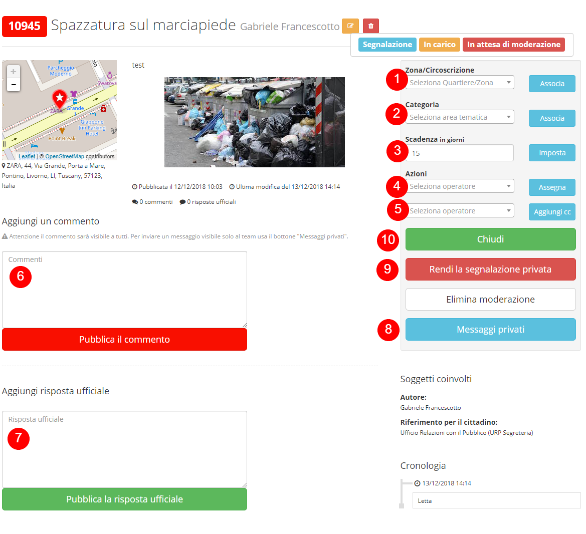

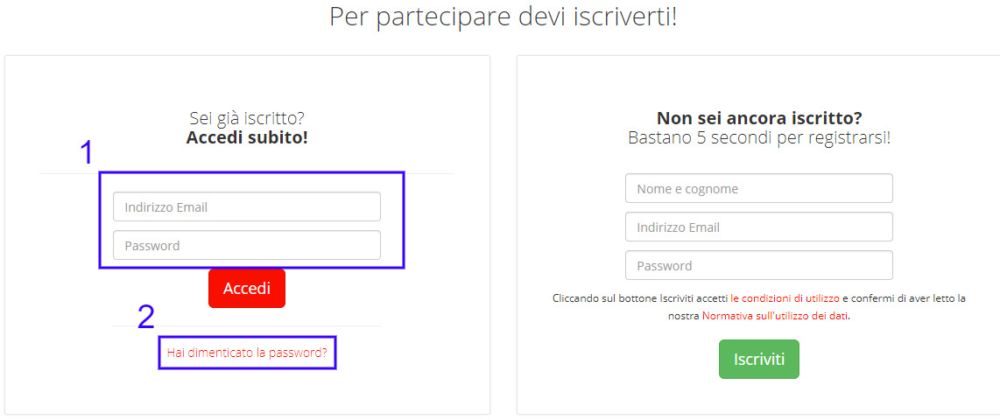

.. |IMG3| image:: static/Manuale_per_gli_operatori_3.png
   :height: 172 px
   :width: 624 px

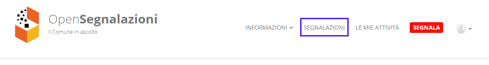

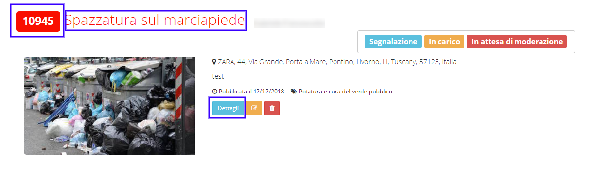

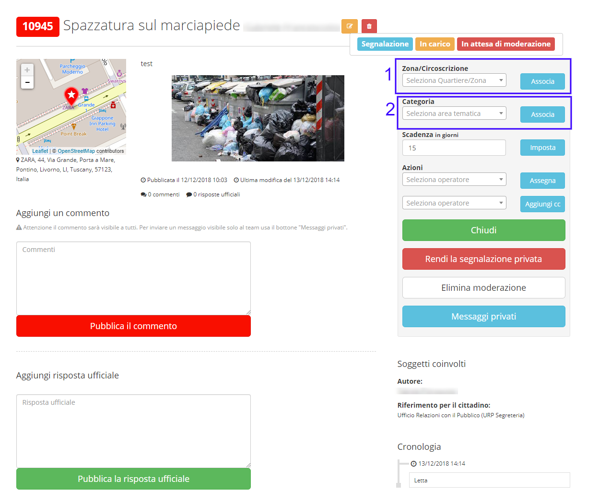

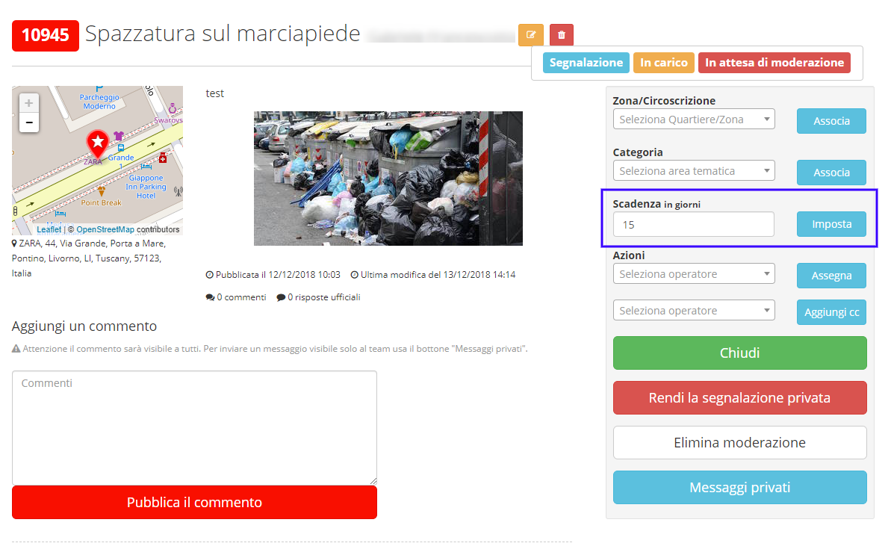

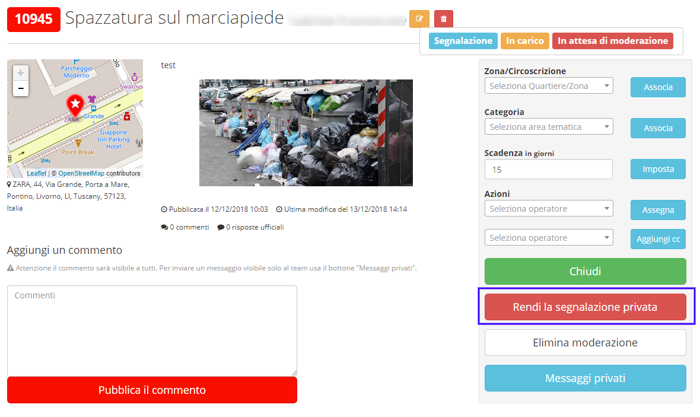

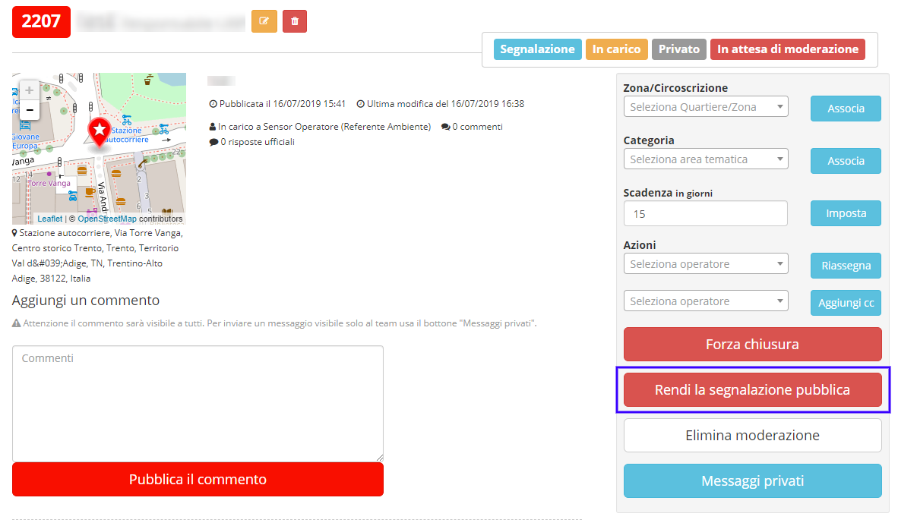

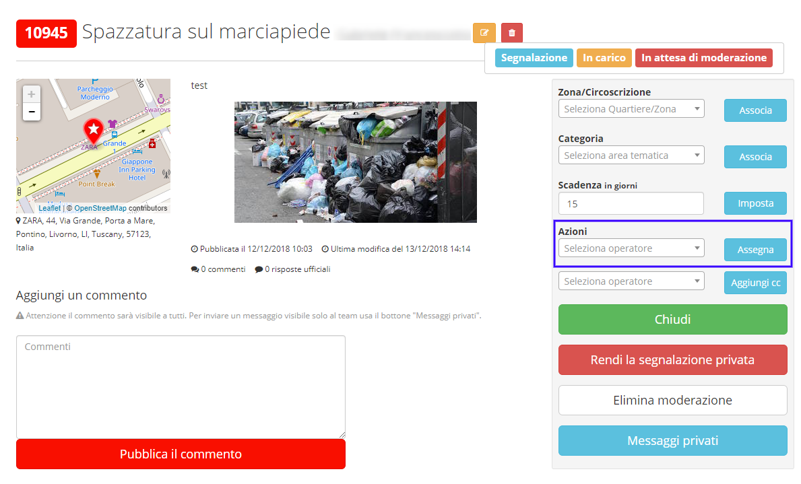

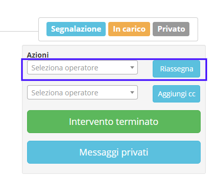

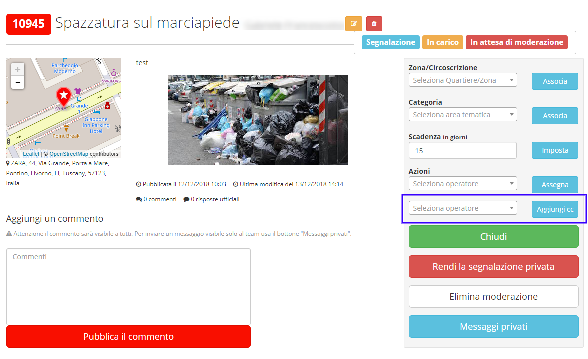

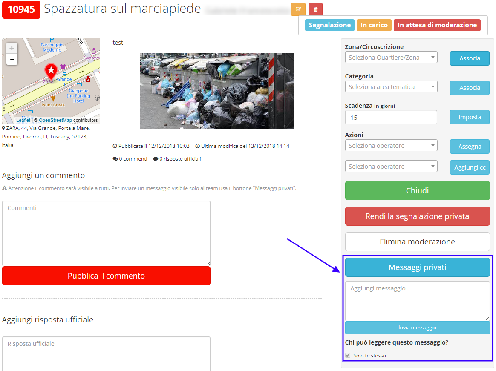

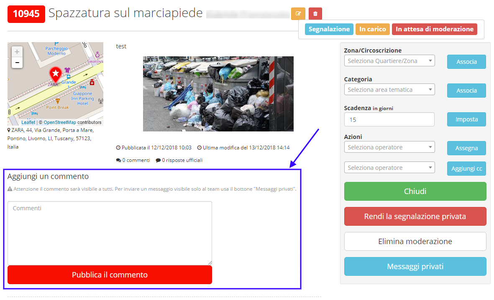

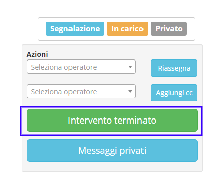

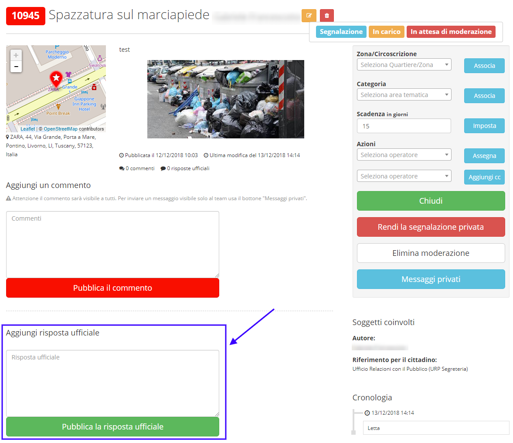

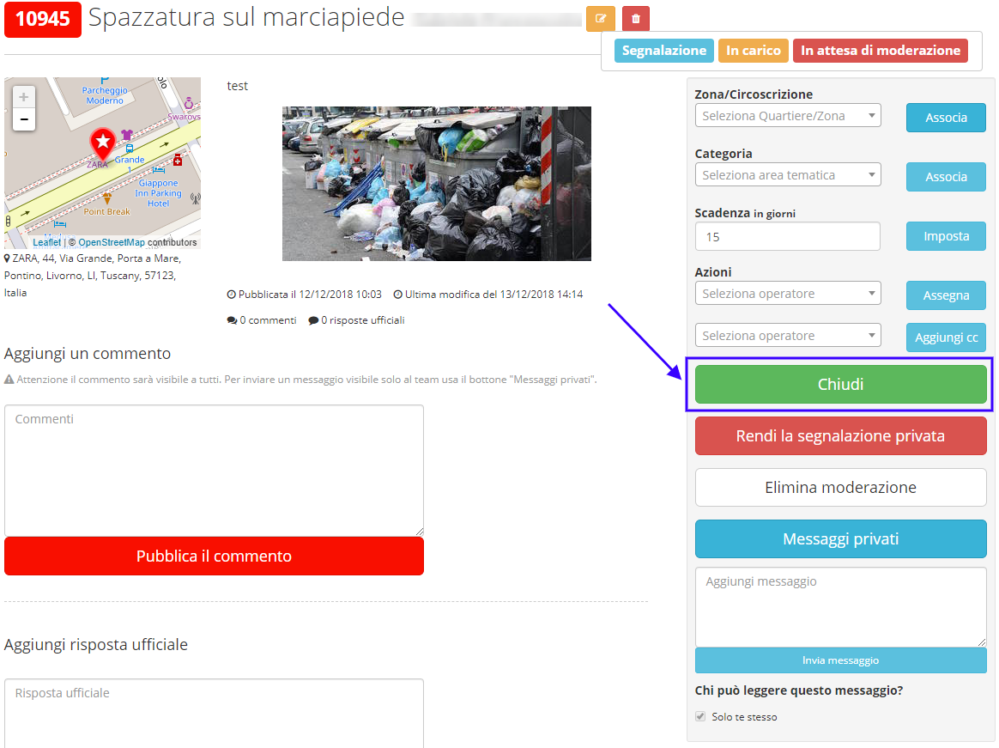

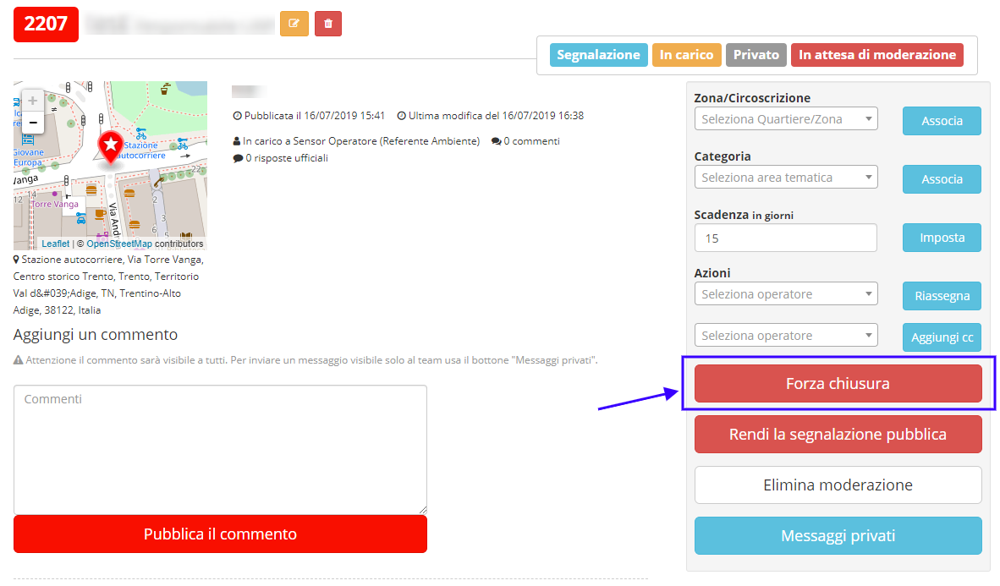
